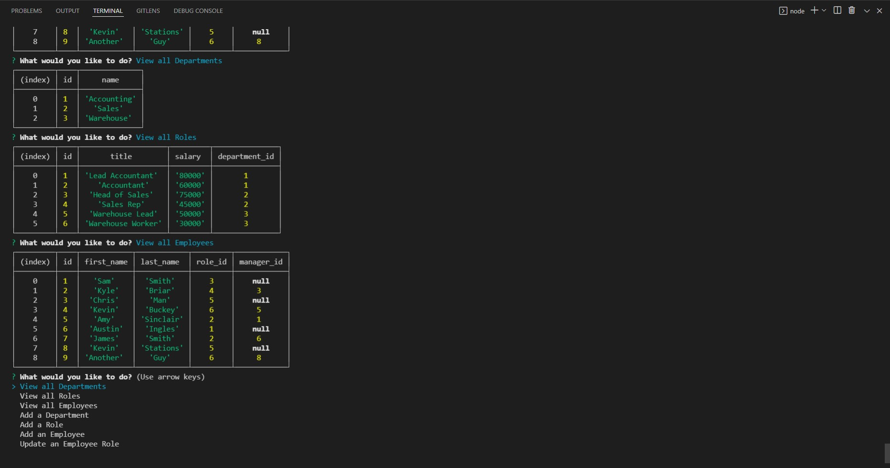

# employee-info-tracker

## Purpose

This application uses SQl queries and Inquirer prompts to populate, save, and view Employee, Role, and Department Information

## Outline

- After running 'npm start' the application gives the user a series of inquirer prompts that allow the user to
- View Departments/Roles/Employees
- Add Departments/Roles/Employees
- Update an Employee
- After the selected task if completed, the first prompt will be shown again

## Built With

- Inquirer
- Javascript
- SQL

## Screenshot

## Walkthrough Video

## Contributor

[John Maclellan](https://github.com/j-maclellan)
